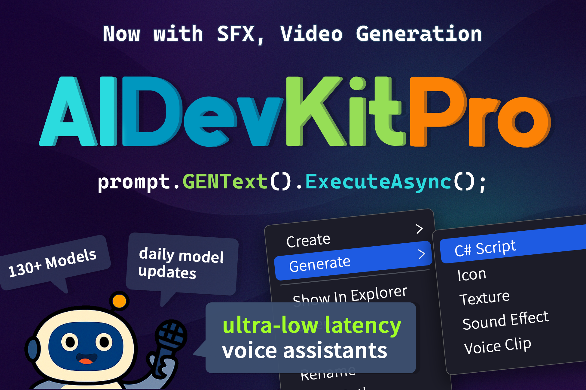
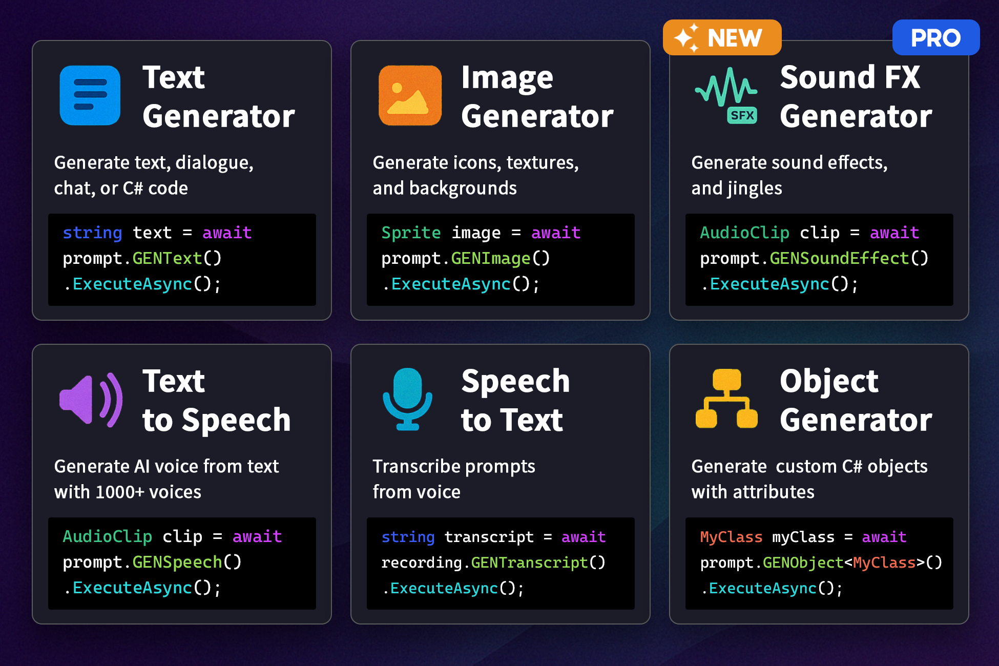
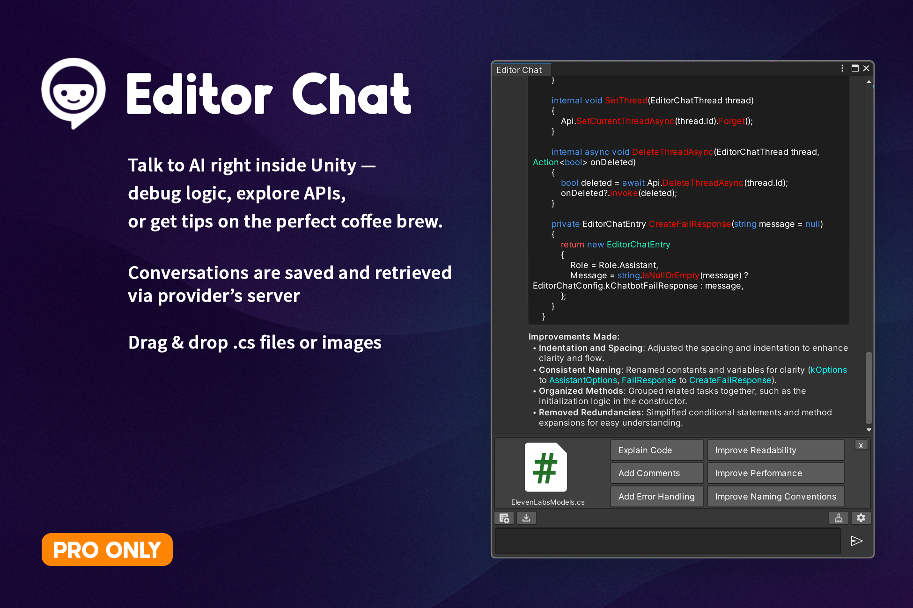
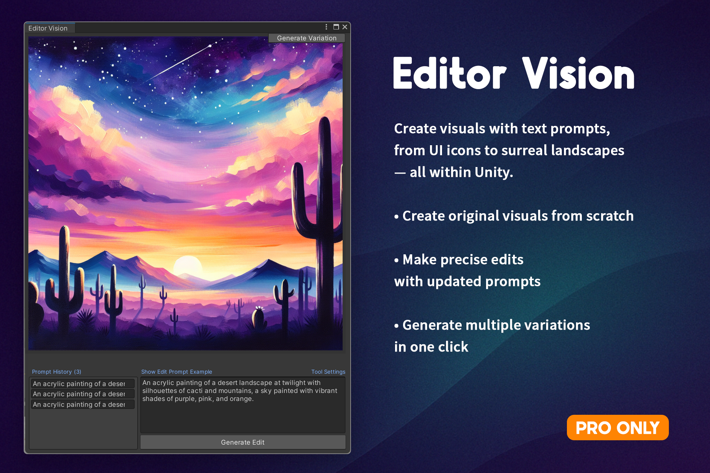
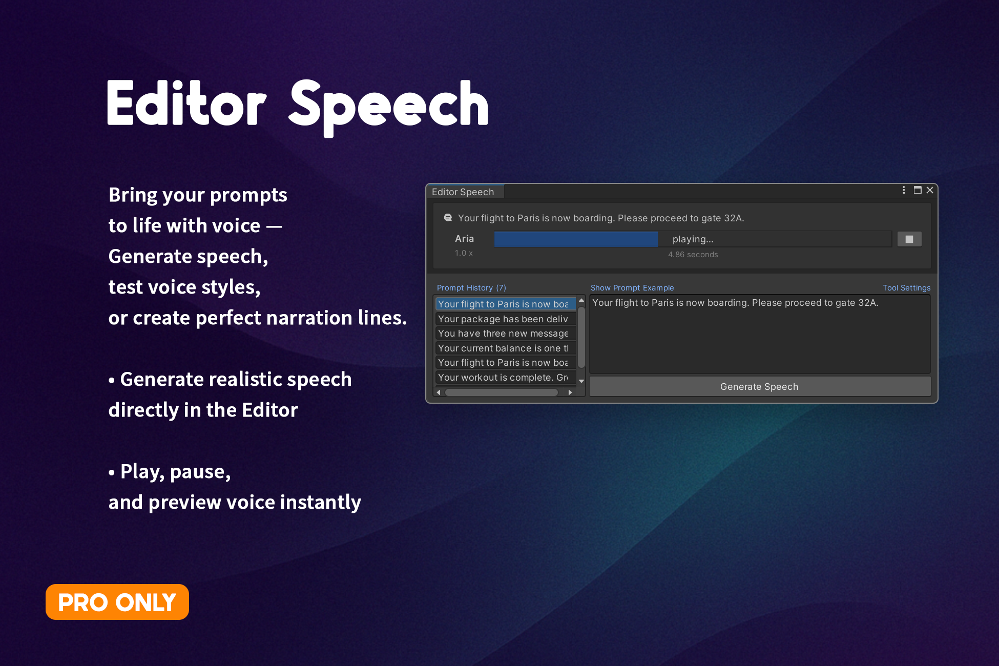

[Get it on Unity Asset Store](https://assetstore.unity.com/packages/tools/ai-ml-integration/ai-development-kit-gpt4o-assistants-api-v2-281225)

## **The Ultimate AI-Suite for Unity**

**AIDevKit** empowers beginner developers to effortlessly integrate advanced AI functionalities directly into Unity, dramatically simplifying your game development workflow.

With just a few clicks and simple text prompts, you can create code, generate images, produce sound effects, and even synthesize voices. AIDevKit offers broad API integrations, rich editor tools, extensive voice synthesis options, and unique audio generation capabilities.

---

## **Supported Providers**

 

One of the most widely used AI platforms, offering powerful models like **GPT-4o**. It supports a broad range of APIs for text, audio, image, and assistant functionalities—ideal for building intelligent, multimodal applications.

#### Supported in AIDevKit

- Text: Chat Completions, Completions (Legacy)
- Image: Creation, Edit, Variation
- Audio: Text To Speech, Speech To Text
- Moderations
- Embeddings
- Models, Fine-Tuning
- Files, Uploads
- Vector Stores
- Administration: Project
- **Advanced (Pro-Only): Realtime, Assistants**

A cutting-edge multimodal AI service by Google, capable of both text and image generation. It is well-suited for developers who need tight integration with Google’s cloud infrastructure and rapid performance.

#### Supported in AIDevKit

- Text: Text Generation, Answer
- Image: Creation (Predict)
- **Video: Creation (Predict Long Runnnig)**
- Moderations (Called via Content Generation request)
- Embeddings
- Models, Fine-Tuning
- Files

 

A state-of-the-art voice platform specializing in **high-quality Text-to-Speech**, **Speech-to-Text**, and **voice transformation**. Perfect for voice assistants, narration, and real-time character dubbing.

#### Supported in AIDevKit

- Text to Speech
- Speech to Text
- **Sound Effects**
- **Voice Changer**
- Audio Isolator
- Models, Voices
- Shared Voice Library

Worried about costs? No Problem! With Ollama you can run LLMs like **LLaMA** and **Mistral** on your own machine for **free**. Ideal for offline development, edge applications, and private inference without relying on cloud services.

#### Supported in AIDevKit

- Text: Chat Completion, Completion
- Model Management

 

A gateway to multiple third-party LLMs offering **300+ models** including **Claude, Mistral, Command R, and more—all** accessible via a single API. Great for experimenting with various models without switching providers.

#### Supported in AIDevKit

- Text: Chat Completions
- Model Selection
- Pricing Metadata

 

> [!NOTE]
> More API integrations are on the way: Have something you'd like to see next? Let us know via [Discord](https://discord.com/invite/hgajxPpJYf) — your feedback shapes the roadmap.

---

## **Generative Features**

---

## **Editor Tools**

- ### Unity-Specialized AI Chat

Chat directly with an integrated AI-powered assistant within the Unity Editor. Ask anything from *"How do I fix this error?"* to *"What scripts do I need for character jumping?"* The assistant provides clear explanations, coding tips, and even edits existing scripts on command, simplifying your coding process.

- ### Image & Texture Generation

Generate detailed textures, sprites, icons, and concept art directly from descriptive text prompts using cutting-edge AI like DALL·E and Stable Diffusion. Just input something like *"Pixel art icon of a magic sword with blue flames,"* and receive high-quality assets instantly ready to use.

- ### Speech Generation

Blah blah

---

## **Supported Platforms**

- Windows
- OSX
- Linux
- Unity WebGL (Audio related tasks may not be available. Please let me know if there are any missing features for WebGL)
- iOS
- Android
- Windows Phone/Store
- PlayStation
- Xbox
- PS Vita/PSM
- Switch

